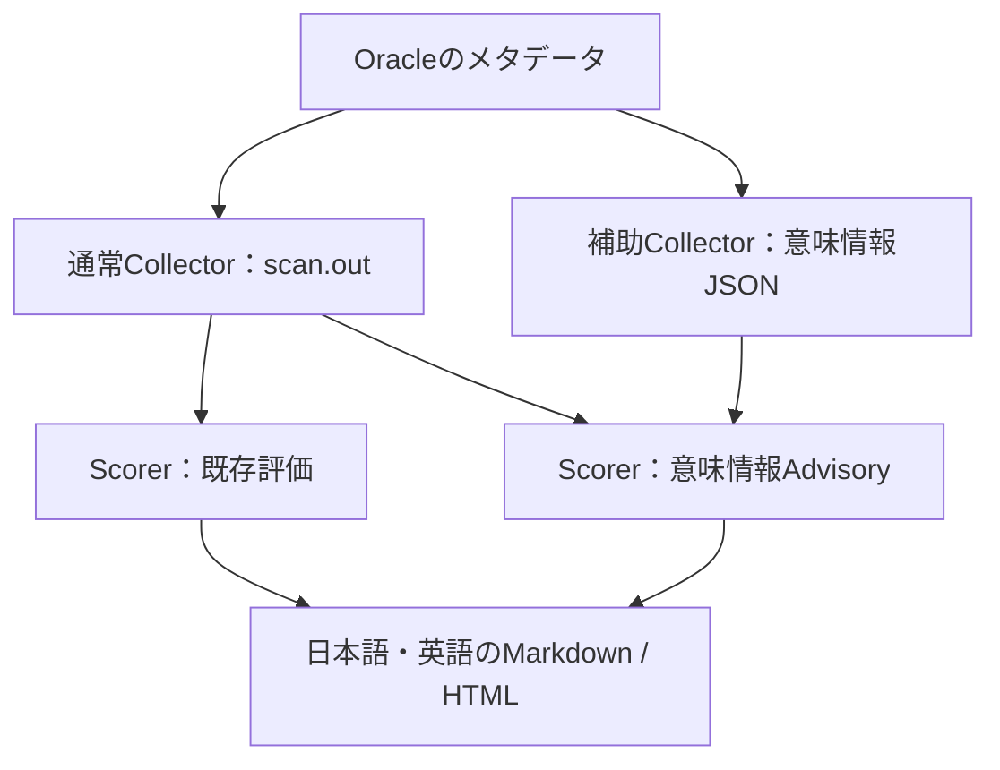

# oracle-ai-ready-data Skill 第3回: ANNOTATIONSとDomainでNL2SQLを検証し、Skillをv0.4へ進化させてみた

# ■ はじめに

[第2回](https://qiita.com/shirok/items/6a2a3e6992ab0eb93d7a)では、`BAD_AI_READY`スキーマのCOMMENT、PK/FK、鮮度・出所などのメタデータを整備し、AI Readyスコアを`0.22`から`0.97`へ改善しました。最後に、Select AIによる自然言語からのSQL生成も確認しました。

今回は、その続きです。COMMENTで基本的な説明を整えたうえで、業務用語やコード値の対応を`ANNOTATIONS`として追加し、`Domain`に定義したAnnotationもSelect AIで使えるかを検証します。さらに、この実測をもとに`oracle-ai-ready-data` Skillをv0.4へ拡張しました。

今回のポイントは、**意味情報を登録したこと、Select AIのプロンプトに含まれたこと、生成SQLが正しかったことを、別々の証跡で確認すること**です。SkillのレポートでAnnotationが見えるだけでは、SQLの正しさまで証明したことにはなりません。

ということで、`ANNOTATIONS`と`Domain`で業務上の意味を補い、Select AIの実測からSkillのバージョンアップまでしてみます。

## ● 今回の結果

| 確認したこと | 今回の結果 |
| --- | --- |
| 列へ直接付けたAnnotation | `annotations=true`でSHOWPROMPTに含まれた |
| Domain由来のAnnotation | 列への継承とSHOWPROMPTへの取り込みを確認 |
| 意味を推測しにくい最小実験 | Direct／DomainともOnは3回中3回正解、Offは3回中0回 |
| 第2回の整備済み3表で比較 | Off／Onとも2問×3回で正解。今回の設問では精度差なし |
| Skill v0.4の実DB検証 | 直接／継承の区別、列coverage、日英レポートを確認 |
| 既存評価への影響 | 同じscanでAdvisory有無の既存評価部分が完全一致 |

前半のSelect AI実測は2026年9月18日、v0.4の最終再検証は9月23日に実施しました。以下の正答回数は、この質問・データ・モデルでの観測値です。

# ■ COMMENT・ANNOTATIONS・Domainをどう使い分けるか

| 要素 | AIへ意味を伝えるための使いどころ | 今回の使い方 |
| --- | --- | --- |
| COMMENT | 表の目的、行の粒度、列の用途、単位などの基本説明 | 第2回で整備した説明を後半の比較で利用 |
| ANNOTATIONS | 説明・別名・値対応などを名前付きのメタデータにする | `DESCRIPTION`、`ALIASES`、`VALUES`で注文状態を説明 |
| Domain | 型や意味の定義を複数の列で再利用する | 状態コードのAnnotationをDomainに置き、列へ継承 |

Select AIのProfileでは、`comments`が表・列のコメント、`annotations`が表・列のAnnotation、`constraints`がPK/FK等の参照制約をプロンプトへ含める設定です。本稿ではDomain専用のProfile属性を追加せず、`annotations`で比較します。[DBMS_CLOUD_AI Profile Attributes](https://docs.oracle.com/en/cloud/paas/autonomous-database/serverless/adbsb/dbms-cloud-ai-package.html)

Domainから継承したAnnotationには、`ALL_ANNOTATIONS_USAGE`の`DOMAIN_OWNER`、`DOMAIN_NAME`に継承元が記録されます。今回使う関連ビュー`USER_ANNOTATIONS_USAGE`も含め、利用可能な環境を先に確認します。[ALL_ANNOTATIONS_USAGE](https://docs.oracle.com/en/database/oracle/oracle-database/26/refrn/ALL_ANNOTATIONS_USAGE.html)

`VALUES`に「Q7は有効」と書いても、Databaseがその文章をCHECK制約として実行するわけではありません。今回は、AIがSQLを生成する際に参照できる説明として使用します。

このためCOMMENTの有無を判定する既存ゲートは維持し、Annotation／Domainはv0.4では**Advisory（補足評価）**として扱います。

# ■ 第2回から引き継ぐ環境

## ● Userと作業の役割

| 項目 | 今回の環境 |
| --- | --- |
| Database | Oracle AI Database 26ai、23.26.3.3.0 |
| データ所有者 | `BAD_AI_READY` |
| Select AI実行User | `ADB_USER` |
| 接続識別子 | `YOUR_DB_SERVICE`。読者の環境では実際の接続識別子へ置換 |
| Credential | `ADB_USER`が所有する既存Credential（本文では`MY_OPENAI_CRED`と表記） |
| Select AI実測のprovider／model | `openai`／`gpt-5.4-nano` |
| v0.4最終再検証のSQLcl | 25.4 |
| Codexのローカルテスト環境 | Python 3.14.3 |

モデル名は今回の実測条件です。再現する場合は、利用環境で動作確認済みのモデルを明示し、比較中は固定してください。

既存の第2回環境に、`AIRD_D01`、`AIRD_T02`、`AIRD_T03`と比較用Profileを追加します。第2回のUser作成スクリプトは再実行しません。

本文の接続識別子とCredential名は公開用の例示です。実際の名前は自分の環境で確認してください。

## ● Credential名とモデル名は別に確認

実際の作業では、既存Profileが`OPENAI_CRED`を参照している一方、Userが所有していたCredentialは`MY_OPENAI_CRED`だったため、Profile作成時にエラーになりました。

`ADB_USER`で次を確認します。

```sql
SHOW USER

SELECT credential_name, username
FROM user_credentials
ORDER BY credential_name;

SELECT profile_name, attribute_name, attribute_value
FROM user_cloud_ai_profile_attributes
WHERE profile_name = 'BAD_AI_READY_OPENAI'
  AND LOWER(attribute_name) IN ('provider', 'credential_name', 'model')
ORDER BY attribute_name;
```

`MY_OPENAI_CRED`はCredentialのオブジェクト名であり、モデル名の入力欄へは入れません。APIキーの値をSQLや記事へ書く必要もありません。

# ■ 最小の制御実験：コード値の意味を渡す

## ● データと質問を固定する

同じ3行を持つ2表を用意しました。`AIRD_T02`は列への直接Annotation、`AIRD_T03`はDomain経由のAnnotationです。

| C01：注文ID | C02：金額 | C03：状態コード |
| --- | ---: | --- |
| O001 | 1200 | Q7 |
| O002 | 800 | Q7 |
| O003 | 500 | X9 |

`Q7`が有効、`X9`が取消です。有効な注文の合計は`2000`、全件合計は`2500`になります。

質問は次の一文に固定しました。

> 有効な注文について、C02の合計を教えてください。

金額列は`C02`と明示し、「どのコードが有効な注文か」という対応に焦点を合わせます。COMMENT、PK/FK、CHECKはこのラボには付けません。

## ● 登録したAnnotationとDomain

次は初回のラボ作成で使用した定義の主要部分です。すでにラボがある場合は再実行せず、次の辞書確認から進めます。

```sql
CREATE DOMAIN AIRD_D01 AS VARCHAR2(2 CHAR)
  ANNOTATIONS (
    DESCRIPTION 'MAP_PROOF_V1: Order status code. 有効な注文 means active orders.',
    ALIASES 'Order status, 注文状態, 注文ステータス',
    "VALUES" 'Q7 = active (有効な注文); X9 = cancelled (取消済みの注文)'
  );

CREATE TABLE AIRD_T02 (
  C01 VARCHAR2(10 CHAR),
  C02 NUMBER(12,2),
  C03 VARCHAR2(2 CHAR)
    ANNOTATIONS (
      DESCRIPTION 'MAP_PROOF_V1: Order status code. 有効な注文 means active orders.',
      ALIASES 'Order status, 注文状態, 注文ステータス',
      "VALUES" 'Q7 = active (有効な注文); X9 = cancelled (取消済みの注文)'
    )
);

CREATE TABLE AIRD_T03 (
  C01 VARCHAR2(10 CHAR),
  C02 NUMBER(12,2),
  C03 VARCHAR2(2 CHAR) DOMAIN AIRD_D01
);
```

`AIRD_T03.C03`へはAnnotationを直接書いていません。Domain側の定義が列へ継承されるかを確認するためです。ラベルは、OracleのAI Enrichmentガイドで説明されている`DESCRIPTION`、`ALIASES`、`VALUES`を参考にしました。[Best Practices for Enriching Your Database Schema](https://docs.oracle.com/en/database/oracle/oracle-database/26/aienb/best-practices-enriching-your-database-schema.html)

## ● まず辞書で由来を確認

`BAD_AI_READY`で実行します。

```sql
SELECT table_name, column_name, domain_owner, domain_name
FROM user_tab_columns
WHERE table_name IN ('AIRD_T02', 'AIRD_T03')
  AND column_name = 'C03'
ORDER BY table_name;

SELECT object_name, column_name, annotation_name, annotation_value,
       domain_owner, domain_name
FROM user_annotations_usage
WHERE object_name IN ('AIRD_T02', 'AIRD_T03')
ORDER BY object_name, column_name, annotation_name;
```

| 確認対象 | 直接登録 | Domainから継承 |
| --- | --- | --- |
| 列 | `AIRD_T02.C03` | `AIRD_T03.C03` |
| Annotation | 3ラベル | 同じ3ラベル |
| 継承元Domain | NULL | `BAD_AI_READY.AIRD_D01` |

登録場所と継承元が確認できました。続いて、Select AIが組み立てるプロンプトを確認します。

## ● 4つのProfileで比較

| 条件 | Profile | 対象表 | annotations |
| --- | --- | --- | --- |
| Direct-Off | `AIRD_P_D_OFF` | `AIRD_T02` | false |
| Direct-On | `AIRD_P_D_ON` | `AIRD_T02` | true |
| Domain-Off | `AIRD_P_M_OFF` | `AIRD_T03` | false |
| Domain-On | `AIRD_P_M_ON` | `AIRD_T03` | true |

共通条件は`comments=false`、`constraints=false`、`conversation=false`、`enforce_object_list=true`です。同じ表のOff／Onで、provider、model、Credential、対象表などをそろえ、`annotations`だけを切り替えます。

Profile属性も保存します。

```sql
SELECT profile_name, attribute_name, attribute_value
FROM user_cloud_ai_profile_attributes
WHERE profile_name IN (
  'AIRD_P_D_OFF', 'AIRD_P_D_ON', 'AIRD_P_M_OFF', 'AIRD_P_M_ON'
)
ORDER BY profile_name, attribute_name;
```

DirectとDomainは別の表です。この比較から「Domainの方が精度が高い」とは判断しません。

## ● SHOWPROMPTに値の対応が現れるか

SQLclの新しい`ADB_USER`セッションで、Profileを選択します。以下はDomain-Onの例です。

```sql
SET ECHO OFF
SET FEEDBACK OFF
SET HEADING OFF
SET PAGESIZE 0
SET LINESIZE 32767
SET LONG 1000000
SET LONGCHUNKSIZE 1000000

EXEC DBMS_CLOUD_AI.SET_PROFILE('AIRD_P_M_ON');

SELECT AI SHOWPROMPT 有効な注文について、C02の合計を教えてください。;
SELECT AI SHOWSQL 有効な注文について、C02の合計を教えてください。;
```

`SHOWPROMPT`は、モデルへ送る構築済みプロンプトを表示する機能です。`SHOWSQL`とは別の呼び出しとして証跡を残します。[Use AI Keyword to Enter Prompts](https://docs.oracle.com/en/database/oracle/oracle-database/26/selai/use-ai-keyword-enter-prompts.html)

保存したプロンプトを比較すると、OffにはC03の列定義だけがあり、Onには次の意味情報が追加されました。

```text
DESCRIPTION: MAP_PROOF_V1: Order status code. 有効な注文 means active orders.
ALIASES: Order status, 注文状態, 注文ステータス
VALUES: Q7 = active (有効な注文); X9 = cancelled (取消済みの注文)
```

上は読みやすく整理した抜粋です。実際のプロンプトでは、表定義のC03に`ANNOTATIONS(...)`として含まれていました。Direct-OnだけでなくDomain-Onでも確認できました。

ファイルを確認する補助コマンドは次です。macOS標準の`grep`で実行できます。

```bash
grep -HnE 'MAP_PROOF_V1|Q7 = active|X9 = cancelled' logs/*_showprompt.txt
```

DDLのログにマーカーが見つかっただけでは、プロンプトへ取り込まれた証拠にはなりません。対象はSHOWPROMPTの出力ファイルです。

## ● 保存した生成SQLを実行

Direct-Onの1回目では、次のSQLが生成されました。

```sql
SELECT
  SUM("t"."C02") AS "total_c02"
FROM "BAD_AI_READY"."AIRD_T02" "t"
WHERE "t"."C03" = 'Q7';
```

Domain-Onの1回目も、同じ状態コードを選びました。

```sql
SELECT
  SUM(t."C02") AS "valid_order_c02_total"
FROM "BAD_AI_READY"."AIRD_T03" t
WHERE t."C03" = 'Q7';
```

生成SQLを保存してレビューし、**そのSQLそのもの**を実行した結果、どちらも`2000`でした。

一方、Direct-Offの1回目は状態条件がなく、Domain-Offの1回目は`UPPER(C03) = '有効'`という条件でした。これらは保存したSHOWSQLの内容を読んで確認したものです。

| 条件 | 保存SQLの意味・実行結果が正しかった回数 | 今回観測した結果 |
| --- | ---: | --- |
| Direct-Off | 0 / 3 | 2500 |
| Direct-On | 3 / 3 | 2000 |
| Domain-Off | 0 / 3 | NULL |
| Domain-On | 3 / 3 | 2000 |

`2000`になっただけで正解にせず、`SUM(C02)`と`C03 = 'Q7'`相当の条件も確認しました。

## ● RUNSQLは別試行として記録

別途、4条件を各3回、RUNSQLでも実行しました。

```sql
SET NULL '(NULL)'
SELECT AI RUNSQL 有効な注文について、C02の合計を教えてください。;
```

| 条件 | 別試行RUNSQLの結果 | 正解数 |
| --- | --- | ---: |
| Direct-Off | 2500、2500、2500 | 0 / 3 |
| Direct-On | 2000、2000、2000 | 3 / 3 |
| Domain-Off | NULL、NULL、NULL | 0 / 3 |
| Domain-On | 2000、2000、2000 | 3 / 3 |

12試行はDatabaseエラーなく完了しました。ただし、RUNSQLは自然言語から新たにSQLを生成して実行します。先ほど保存したSHOWSQLをそのまま実行した証跡にはなりません。

また、RUNSQLの`2500`や`NULL`だけから、内部SQLのWHERE条件や対象行数は断定しません。結果は結果として、保存SQLのレビューとは分けて扱います。

# ■ 第2回の整備済みデータでも比較する

## ● COMMENTとPK/FKを残した比較

後半は、第2回で整備済みの次の3表を対象にしました。

- `RAW_CUSTOMERS`
- `RAW_ORDERS`
- `RAW_ORDER_LINES`

`comments=true`、`constraints=true`とし、顧客の状態・国コードへ直接Annotationを追加しました。既存列へDomainを新たに関連付けることはしていません。

| 列 | 追加した意味情報 |
| --- | --- |
| `RAW_CUSTOMERS.STATUS_TXT` | 有効な顧客は`ACTIVE`。確認用マーカーは`PART3_CUSTOMER_V1` |
| `RAW_CUSTOMERS.COUNTRY_CODE` | 日本の顧客は`JP` |

設問は次の2問です。

1. 日本の有効な顧客は何人ですか。
2. 日本の有効な顧客が購入した商品の総数量をSKU別に集計し、総数量の多い順、同数の場合はSKUの昇順で上位10件を表示してください。

Q1の参照結果は`6`、Q2は3表をJOINし、`QUANTITY_TXT`を数値化してSKU別に集計した10行です。比較前に参照SQLで正解を確認しました。

## ● 今回はOff／Onとも正解

| 設問 | Annotation Off | Annotation On |
| --- | ---: | ---: |
| Q1：日本の有効な顧客数 | 3 / 3 | 3 / 3 |
| Q2：3表JOIN・SKU別数量 | 3 / 3 | 3 / 3 |
| 合計 | 6 / 6 | 6 / 6 |

OnのSHOWPROMPTには追加Annotationが含まれましたが、今回の2問では精度差は観測しませんでした。既存COMMENTにも`ACTIVE`などの値情報や列の用途が記載されていました。

最小実験では改善し、整備済みデータでは両方正解でした。したがって、「Annotationを付ければ必ず精度が上がる」とまとめるのではなく、**AIに不足している業務上の意味を補えたか**として評価します。

# ■ 実測をoracle-ai-ready-data v0.4へ組み込む

## ● v0.4で増えたこと

既存のProfile生成器には、すでに`annotations`を設定する機能がありました。今回追加した中心機能は、Annotation／Domainを**収集・集計・レポート表示する経路**です。

| v0.4の追加機能 | レポートで分かること |
| --- | --- |
| 任意の補助JSON Collector | 辞書上で取得できた意味情報と収集状態 |
| 列Annotation coverage | 対象列のうち、Annotationがある列の割合 |
| 由来の区別 | 直接登録／Domain継承／由来不明 |
| Domain関連付け | どの列がどのDomainを参照しているか |
| 日本語・英語のMarkdown／HTML | 同じ収集結果を用途に応じた形式で確認 |
| 不正scanの入力検証 | SQLclのecho混入等を採点前に検出 |

通常のCollectorが生成するscanへ、任意のJSONを追加で渡します。JSONを渡さない既存の使い方も維持しています。



Pythonの生成器は収集SQLを作り、そのSQLを利用者がSQLclで実行します。この収集・評価経路ではLLMを呼び出しません。

## ● 収集できなかった情報を0%にしない

v0.4では、収集成功、未収集、非対応確認済み、権限不足確認済み、原因未確定、エラーを区別します。

coverageの母数は、補助Collectorの収集範囲と通常scanの対象が重なる列です。対象0件や未収集では`N/A`とし、「設定がないため0%」と混同しません。直接登録とDomain継承が同じ列にあっても、全体の列数には1列として数えます。

# ■ v0.4で実DBからレポートを作る

この章は、最小実験の2表とDomainがすでにある状態から実行します。コードはv0.4の実装を前提にしています。

## ● 1. 作業ディレクトリを分ける

リポジトリのルートへ移動して実行します。以下の変数は同じターミナルで使用します。

```bash
cd oracle-ai-ready-data
repo_dir="$PWD"
validation_dir="$(mktemp -d "$repo_dir/validation_part3_XXXXXX")"

git rev-parse HEAD > "$validation_dir/source_head.txt"
shasum -a 256 \
  scripts/oracle_ai_ready_collect.sql \
  scripts/score_oracle_ai_ready_scan.py \
  scripts/generate_semantics_collector.py \
  scripts/oracle_ai_semantics_collect.sql.in \
  > "$validation_dir/source_sha256.txt"
```

通常Collectorの出力名は同じなので、過去のscanを上書きしないように保存先を分けます。

## ● 2. 補助Collectorを生成

```bash
python3 scripts/generate_semantics_collector.py \
  --owner BAD_AI_READY \
  --table-like 'AIRD_T0%' \
  --output "$validation_dir/collect_semantics.sql" \
  --spool-file semantics_r01.json
```

今回の実測では`AIRD_T0%`がラボ2表だけに一致することを確認しています。LIKEの`_`はワイルドカードなので、別の表が一致する環境では対象パターンを調整してください。

## ● 3. 通常scanを取得

```bash
cd "$validation_dir"
sql BAD_AI_READY@YOUR_DB_SERVICE
```

SQLclで実行します。

```sql
SHOW USER

SELECT table_name
FROM user_tables
WHERE table_name LIKE 'AIRD_T0%'
ORDER BY table_name;

SET ECHO ON
SHOW ECHO

@../scripts/oracle_ai_ready_collect.sql BAD_AI_READY AIRD_T0% scan
```

対象は`AIRD_T02`、`AIRD_T03`の2表です。ここでは修正確認も兼ね、あえて呼び出し元をECHO ONにしています。Collector自身がSPOOL前にOFFへ切り替えます。

通常Collectorは終了時にSQLclを切断します。Macのターミナルへ戻ったら確認します。

```bash
scan_input="$validation_dir/oracle_ai_ready_scan_BAD_AI_READY_scan.out"
grep -nE '^[[:space:]]*SQL>' "$scan_input"
grep -n '^@@SECTION:' "$scan_input"
```

今回のラボでは1つ目は一致なし、2つ目は12セクションが期待値です。このgrepだけで採点を合格にはせず、後段でScorerも実行します。

## ● 4. 再接続して補助JSONを取得

```bash
sql BAD_AI_READY@YOUR_DB_SERVICE
```

```sql
SHOW USER
@collect_semantics.sql
HOST ls -lh ./semantics_r01.json
EXIT ROLLBACK
```

補助Collectorは接続を維持するため、新しい収集専用セッションを明示的に終了します。端末のORAエラーやSPOOLエラーも確認します。

```bash
python3 -m json.tool --no-ensure-ascii \
  "$validation_dir/semantics_r01.json" \
  "$validation_dir/semantics_r01.pretty.json"
```

構文が正常でも、収集状態がエラーなら内容の確認が必要です。今回の実測では、`scope`、`annotations`、`domains`のすべてが`collected`でした。

| JSON内のレコード | 件数 |
| --- | ---: |
| 対象表 | 2 |
| 対象列 | 6 |
| Annotation | 6 |
| 列のDomain関連 | 1 |

所有者`BAD_AI_READY`と実行User`ADB_USER`の両方で収集した結果も比較しました。この環境では、接続User・current_schema・収集日時以外の内容が一致しました。別の権限構成で常に同じ可視性になる、という意味ではありません。

## ● 5. 同じscanからJSONなし／ありのレポートを生成

```bash
cd "$repo_dir"

python3 scripts/score_oracle_ai_ready_scan.py \
  "$scan_input" \
  --profile scan --language ja \
  --output "$validation_dir/without_semantics_ja.md" \
  --html-output "$validation_dir/without_semantics_ja.html"

python3 scripts/score_oracle_ai_ready_scan.py \
  "$scan_input" \
  --semantics-input "$validation_dir/semantics_r01.json" \
  --profile scan --language ja \
  --output "$validation_dir/with_semantics_ja.md" \
  --html-output "$validation_dir/with_semantics_ja.html"

python3 scripts/score_oracle_ai_ready_scan.py \
  "$scan_input" \
  --semantics-input "$validation_dir/semantics_r01.json" \
  --profile scan --language en \
  --output "$validation_dir/with_semantics_en.md" \
  --html-output "$validation_dir/with_semantics_en.html"
```

ここで同じscanを使うことが重要です。別々に収集したscanを比較すると、対象範囲や統計の更新なども差分へ混ざります。

## ● 6. 集計結果を確認

最終再検証の実測は次のとおりでした。

| 項目 | JSONなし | JSONあり |
| --- | --- | --- |
| 総合スコア | 0.26 | 0.26 |
| COMMENT必須ゲート | fail | fail |
| 評価対象 | 2表・6列 | 2表・6列 |
| Annotated columns | N/A | 2 |
| Direct columns | N/A | 1 |
| Domain-inherited columns | N/A | 1 |
| Domain-linked columns | N/A | 1 |
| Column annotation coverage | N/A | 33.33% |
| 対象外の意味情報レコード | 0 | 0 |

`C03`に3ラベルあっても、Annotationがある列は1列です。2表全体では2列／6列なので`33.33%`になります。

第2回の8表を改善したときの`0.97`と、今回のラボ2表の`0.26`は評価対象が違います。今回はCOMMENTやPK/FKを付けていないため、`fail`は期待どおりです。Annotationの追加でゲートを迂回していないことも確認できました。

既存評価に相当する第1〜12章を比較したところ、JSON有無で**完全一致**しました。スコアだけでなく、既存のメトリクス・重み・ゲート・改善候補も同じです。

## ● 7. 日本語・英語HTMLを確認

```bash
open "$validation_dir/with_semantics_ja.html"
open "$validation_dir/with_semantics_en.html"
```

最終再検証では、`fixed_with_semantics_ja.html`と`fixed_with_semantics_en.html`を確認しました。日本語／英語の読みやすさ、数値、Annotationの日本語、Domain由来の表示はいずれも問題ありませんでした。

レポート上のProfile・SHOWPROMPT・保存SQL実行などが「未確認」と表示される場合があります。v0.4のScorerはそれらの実行ログを自動採点しないためです。前半のSelect AI実測は、別のランタイム証跡として保持します。

# ■ 実DB検証で見つかったECHO混入も修正

## ● 0表・0列を成功に見せてしまう入力

最初の通常scanには、SQLclのECHO ONを引き継いだ次のような行が混入していました。

```text
SQL> prompt @@SECTION:run_context
@@SECTION:run_context
SQL> select
...
```

修正前は、Scorerが収集内容を正しく認識できず、実際は2表・6列なのに0表・0列として`0.97 / gate pass`を出していました。この結果は評価の証跡から除外し、不具合の再現用として保存しました。

修正は2か所です。

| 修正箇所 | 対応 |
| --- | --- |
| 通常Collector | SPOOL開始前に`SET ECHO OFF` |
| Scorer | echo混入や必須セクション不備を採点前に拒否 |

不正なscanを修正後のScorerへ渡した結果は、終了コード`1`でした。

```text
error: invalid collector input at line 1: SQL> prompt / echoed SQL detected; recollect with SET ECHO OFF before SPOOL
```

MD・HTML・改善SQLは作成されず、誤った評価を出さないことを確認しました。セマンティクスCollectorに残っていた`SET SQLCASE MIXED`も削除し、SQLcl 25.4で警告が消えたことと、収集JSONの内容が変わらないことを確認しています。

## ● 正常な空スコープとは区別

一致する表がないパターンでも、run_contextとinventoryが正常に収集されていれば、有効な空スコープです。この場合は終了コード`0`で0表・0列と認識しました。

v0.4では採点互換性を維持しているため、正常な空スコープは従来の`0.97 / gate pass`のままです。**対象0件の結果をAI Ready認定の根拠にはしません。** 不正な入力と、正しく収集した対象0件を区別することが、今回の修正範囲です。

# ■ 最終確認結果

| 確認 | 結果 |
| --- | --- |
| Codexでのローカルテスト | 2026-09-29にリリース対象で69件成功、compileall・diffチェック成功 |
| 実DB：ECHO ONから収集 | scanへのecho混入なし |
| 実DB：補助JSON | 全componentがcollected、修正前と収集日時以外一致 |
| 同一scanでAdvisory有無を比較 | 既存評価部分が完全一致 |
| 不正scan | 終了コード1、レポート等を生成しない |
| 正常な空スコープ | 終了コード0、0表・0列を認識 |
| 日本語・英語HTML | 内容照合・目視確認とも完了 |

9月29日の69件のローカルテストと、9月23日のDatabaseでの再検証は別の証跡です。主要4ファイルのSHA-256は実DB再検証時と一致しています。リリース準備ではDB接続やLLM呼び出しを再実行していません。今回の実DB確認はOracle AI Database 26ai、SQLcl 25.4のこの環境に対するもので、他バージョンやすべての権限構成まで確認済みとはしていません。

# ■ 新しく再現する場合

v0.4には、最小4条件実験用のSQL生成器も追加しました。初回のSelect AI実測は個別のSQLで行い、生成器はその流れを配布用に整理したものです。生成器のローカルテストと、過去の実DB実測は区別しています。

リポジトリのルートで生成する例です。モデル名とCredential名は自分の環境に合わせます。

```bash
python3 examples/bad_ai_ready_part3/generate_part3.py \
  --output-dir examples/bad_ai_ready_part3/generated_run01 \
  --owner BAD_AI_READY \
  --select-ai-user ADB_USER \
  --credential-name YOUR_EXISTING_CREDENTIAL \
  --model YOUR_VERIFIED_MODEL
```

| 生成されるもの | 用途 |
| --- | --- |
| `01_create_lab.sql` | Domain・2表・データ・SELECT権限 |
| `02_dictionary_reference.sql` | 辞書と参照値 |
| `03_create_profiles.sql` | 4条件のProfile |
| `04_*_probe.sql` | 属性・SHOWPROMPT・SHOWSQL |
| `reviews/*.sql`、`05_*_reviewed.sql` | 保存した生成SQLのレビューと実行 |
| `06_*_runsql.sql` | 明示的に有効化した場合の別試行RUNSQL |
| `99_cleanup_template.sql` | 検証用オブジェクトの手動片付け |

新規環境では生成物を読んでから、所有者とSelect AI実行Userを分けて進めます。

```bash
cd examples/bad_ai_ready_part3/generated_run01
sql BAD_AI_READY@YOUR_DB_SERVICE @01_create_lab.sql
sql BAD_AI_READY@YOUR_DB_SERVICE @02_dictionary_reference.sql
sql ADB_USER@YOUR_DB_SERVICE @03_create_profiles.sql
sql ADB_USER@YOUR_DB_SERVICE @04_AIRD_P_D_ON_r01_probe.sql
```

残る条件・試行もリポジトリ内の`examples/bad_ai_ready_part3/README.md`に沿って実行します。既存の同名表・Domain・Profileがある場合は、新規作成SQLを再実行しません。DB上のDDLは途中の失敗をROLLBACKで一括復元できないため、事前確認と保存先の分離が必要です。

片付ける場合も、対象は今回追加したラボだけです。第2回の8表や既存Profileを削除しません。ラボ表を残したまま`%`で再評価すると、第2回とは分母が変わることにも注意します。

# ■ おわりに

今回の最小実験では、Domainへ付けたAnnotationが列へ継承され、Select AIの構築済みプロンプトに含まれることを確認できました。限定した質問・データ・モデルでは、直接登録とDomain経由の両方でNL2SQLの改善を観測しました。

一方、COMMENTを整えた第2回のデータではOff／Onとも正解でした。COMMENTを基本説明として整え、必要な業務用語・コード値の対応をAnnotationで補い、共通定義はDomainで再利用する、という使い分けができます。

さらにSkill v0.4では、この意味情報を収集し、直接／継承の区別と列coverageを日英レポートで確認できるようになりました。既存スコアは維持し、意味情報の整備状況と、Select AIが実際に生成したSQLの正しさを分けて追えるようにしています。

メタデータの整備、プロンプトへの取り込み、SQLの意味と実行結果を順に確認することで、「AI Readyにしたつもり」から、証跡を持って説明できる状態へ進めました。

# ■ 参考情報

- [oracle-ai-ready-data Skill 第2回](https://qiita.com/shirok/items/6a2a3e6992ab0eb93d7a)
- [oracle-ai-ready-dataリポジトリ](https://github.com/shirok-tech/oracle-ai-ready-data)
- [DBMS_CLOUD_AI Package](https://docs.oracle.com/en/cloud/paas/autonomous-database/serverless/adbsb/dbms-cloud-ai-package.html)
- [Use AI Keyword to Enter Prompts](https://docs.oracle.com/en/database/oracle/oracle-database/26/selai/use-ai-keyword-enter-prompts.html)
- [How LLMs Consume Annotations](https://docs.oracle.com/en/database/oracle/oracle-database/26/aienb/how-llms-consume-annotations.html)
- [Best Practices for Enriching Your Database Schema](https://docs.oracle.com/en/database/oracle/oracle-database/26/aienb/best-practices-enriching-your-database-schema.html)
- [ALL_ANNOTATIONS_USAGE](https://docs.oracle.com/en/database/oracle/oracle-database/26/refrn/ALL_ANNOTATIONS_USAGE.html)
